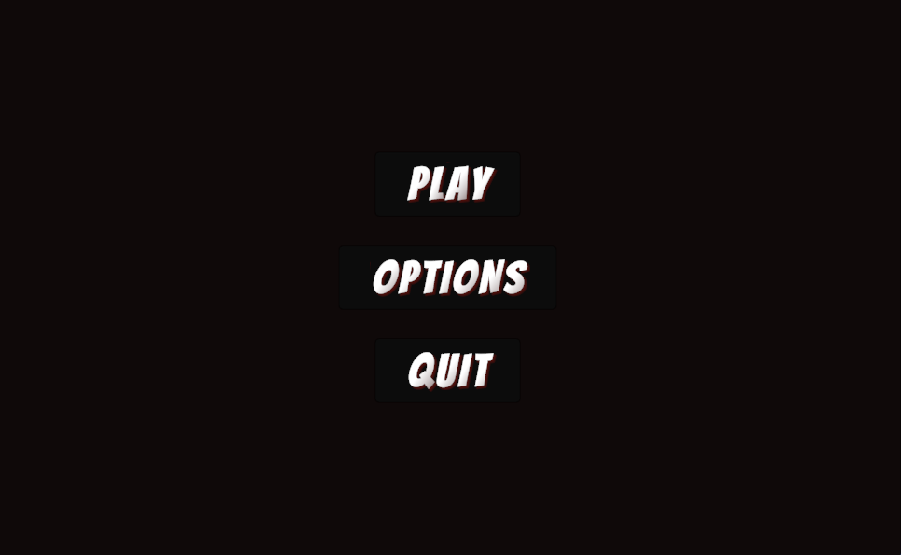
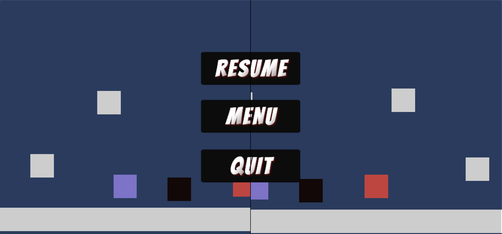
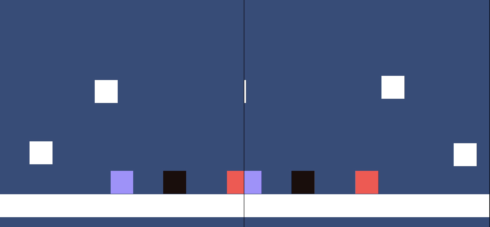

# Game Development Blog post #1 - Lost Together

## Dev Update 1
First milestone for this project is on 17th March. Goal of this milestone was to create Character controllers, Obstacles, Menu and Split Screen.

### Menu
UI menu is displayed at the start of the game. It has 3 options which are Play, Options, and Quit. The game also includes Pause Menu, which is displayed when the user presses the ESC key. Pause Menu consists of 3 options: Resume, Menu, and Quit.
We used Canvas object for creating the Menu. The buttons all have a zoom-in animation when hover over for better interactibility.

 

### Character controllers
We used the new Input system to controll our characters (for now only simple cubes). The reason for choosing the new over the old one was fist of all the convenience of mapping dofferent controllers to the same action (Move and Jump in our case). Secondly, it handles controller reconnection which is always a nice feature to have.

There are two characters and each of them has its own Input Action which consists of Move and Jump. We were guessing here a bit because we have not tested with the arcade machine yet but ince we know it should be mapped similar as the gamepad controlled the mapping is a, d and left stick on gamepad for player1 and left, right and right stick for player2. We will have to test if we got it right for the gamepad but for testing on our machines that works just fine for now. For jumping the controlls are space and j on keyboard and some buttons on gamepad, but we have to test those and see.

We decided to disable collision between the two players so that they can walk throug each other. This seems like a normal and expected game behaviour so that the players cannot push themselves around as that would be a bit weird in a coop game, but what could maybe be interesting is if tey could stand on each other. We think in this case we will have to send out a few demos of our gme and get a feedback from some actual players.

### Character skills
We have 2 characters (players) and each of them has a different skill. Player1 can push heavy objects around, whereas player2 has twice as much jumping force as player1. We believe this will increase the amount of cooperation between the two players as there will be different obstacles along the was.

### Obstacles
We decided to create 3 types of obstacles for now - heavy object, high object, and mechanical object. Heavy object can be only pushed around by the stronger character - player1, high obstacle can only be jumped over by player2, as the character has increased jumping power. The mechanical object can only be moved by interacting with a special type of trigger (e.g. a button to step on).

### Split screen
We decided to use split screen as the arcade machine has 2 sticks and sets of buttons which means the players will be standing next to each other and we found that as a perfect reason for implementing a vertical split screen. Each of the screens is a camera mapped as a child object to a player so that is follows the player everywhere. For now we froze the y axis but will see if we update that as we get to the level design part. There is a narrow border in between the two screens to make the cut more obvious.

For the future milestone we are thinking about creating a smooth follow behaviour so that the gameplay does not feel so aggresive as now because the camera movements are just very sudden and sharp.

