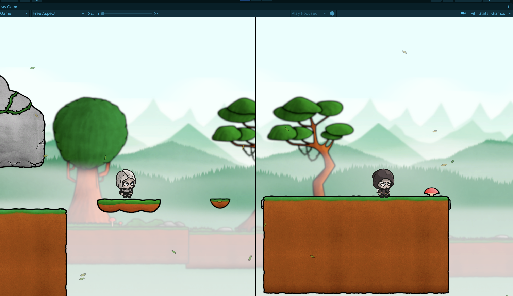
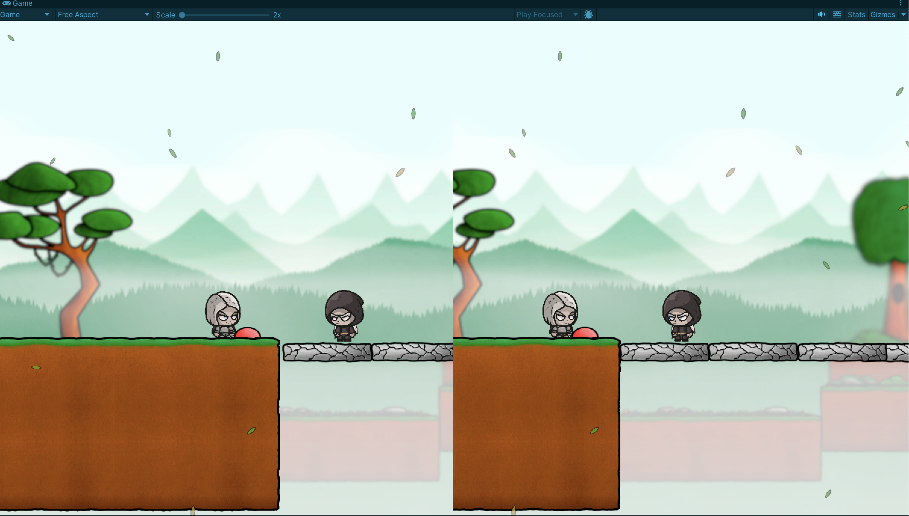
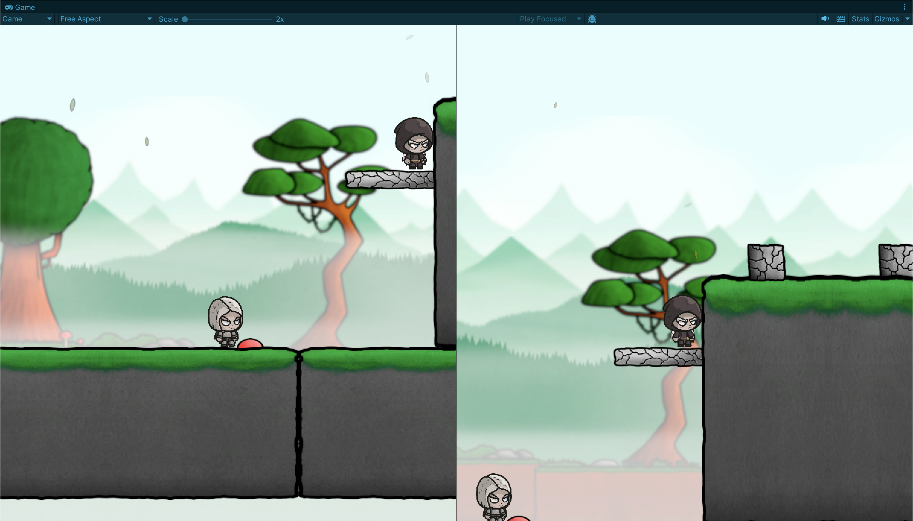
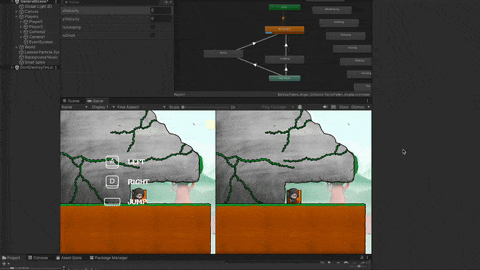

# Game Development Blog post #2 - Lost Together

## Dev Update 2
The second milestone for this project is on 14th April. The goal of this milestone was to create an Environment, Triggers, Collaboration logic between characters, Animations and Character Sprites.

### Environment
For the game environment was used asset from Unity Asset Store which is accessible here: https://assetstore.unity.com/packages/2d/environments/2d-hand-painted-platformer-environment-227159. 

This asset was chosen, because its aesthetics and possibilities match our expectations that were described in Design Document. The asset consists of multiple layers and has a parallax effect. Thanks to the perspective camera it gives the gamer a sense of depth because it shows each layer on different positions on Z-axis. Moreover, the asset has leaves particle system that adds a more dynamic pattern to the game.

 

### Triggers
Triggers are buttons positioned on the ground. Players can press triggers to activate or deactivate objects. Each trigger is configured to react to specific player and control particular object. The implementation follows the Dependency Inversion Principle using an abstract class, ISwitchable, with Activate and Deactivate methods. Currently, there are two classes, VerticalMovement and HorizontalMovement, implementing ISwitchable with different functionalities. This allows any object with an ISwitchable script to be associated with a trigger. For example, a trigger in the picture reacts to one of the players and activates a bridge using HorizontalMovement.

 

### Collaboration logic
One of the main challenges in the game, that players have to overcome is to go through the world, where are some obstacles. From time to time there are obstacles, that one player can not overcome alone and therefore needs the help of other player. This sort of collaboration between players makes this game fun, challenging and brings two players together. The purpose of obstacles, which require collaboration is also to make gamers think about how to overcome certain obstacles. In the picture below can be seen an example of collaboration.

 

### Character Sprites
[Fallen Angels by CraftPix](https://craftpix.net/freebies/free-fallen-angel-chibi-2d-game-sprites/)

We manages to find a package of character sprites online that we really liked and decided to use it. THe good think about this asset was that basic animations like Idle, Running, Jumping, were already part of the package.

### Animations
So far we only implemented character animations. Since we already had the basic animations, it was mostly playing with the animator and trying to figure out the logic of the animations, how should they interrupt each other in different scenarios etc. There are still some issues with the animations we would like to fix, for example, we have a small delay after jumping when the character is in idle animation when running before it switches to running animation again, we suspect that there is a problem with an interrupt and want to fix that in the early stage of the upcoming development.

