# Game Development Blog post #3 - Lost Together

## Dev Update 3
The third milestone for this project is on 7th May. The goal of this milestone was to create Level design (finalize first level), Sound effects, Background music, Dust effect when running/landing a jump, GameLoop (Game over UI), Map controlls with VIA Arcade Machine, Possibly: Enemies

### Level Design (Finished First Level)
An important part of this milestone was to finish the first level. To achieve that we added one more obstacle and a finish line (You can read more about the finish line in the section game loop). In the image, below can be seen new obstacle that was added to the first level.

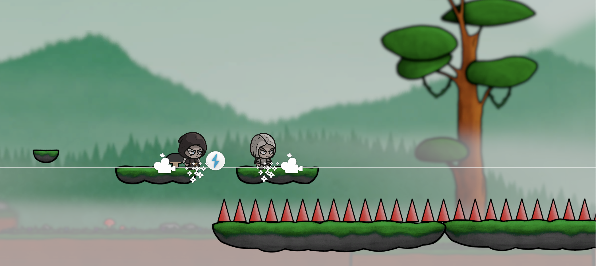 

### Sound Effects
This feature was one of the more challengin ones, not only did we have to create a system for playing sound effects (for now only while character jumps) but we also needed to adjust our options menu and sound volume preferences.

For playing a sound effect we created a SoundFXManager object which has a script with the same name that takes a SoundFXObject as a parameter which is then initialized as a game object in the scene and played when a PlaySound() function is called, we call the Destroy() function at the end to destroy the object after the audio clip is done playing. The SoundFXManager is a singleton for easy access accross the project, we could make it singleton because we know there will always be only one SoundFXManager in a scene.

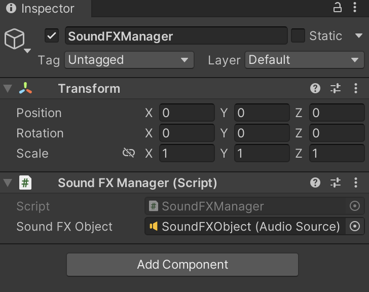 
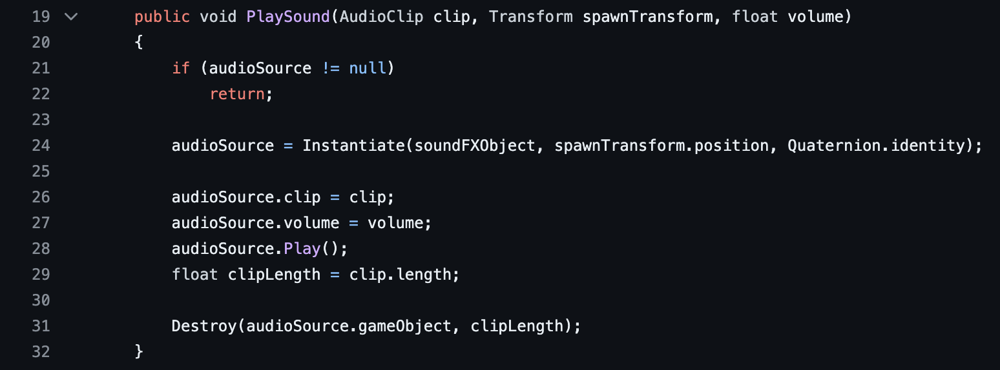 

Then there is a CharacterFXPlayer script which takes one or more audio clips as parameters. This clip is then played whenever the sound function is called. In this case we call the PlayJumpSound in the MovementController whenever the character jumps.

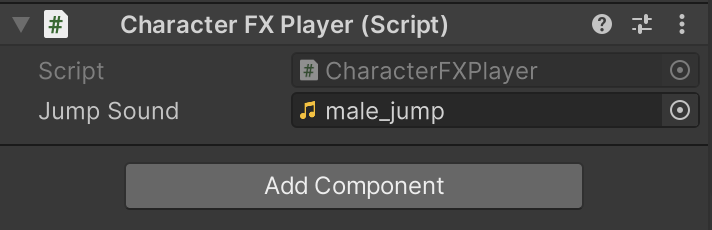 
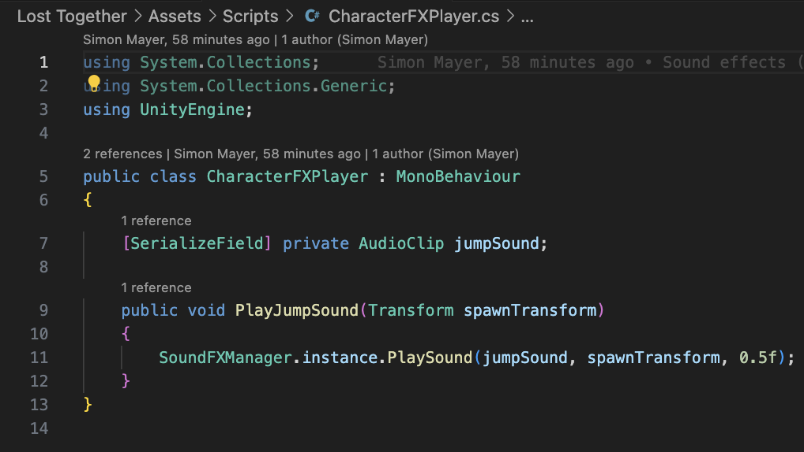 

### Background music
This was a straight forward task. We created an empty object in the scene with an audio source and selected PlayOnAwake and Loop parameters. The fun part came when we decided that we want the music to play accross scenes without resetting, so how did we achieve that?

We made it as an undestroyable singleton object. in the Awake() function we assign itself to an instance and then we pass this game object into the DoNtDestroyOnLoad() function which takes care of not destroying the object when scenes are changed. In case we have this BackgrounMusic object in multiple scenes we added the Destroy() function whenever an instance already exists, this ensures that we do not end up with multiple overlapping game objects with background music, because that would not sound good. 

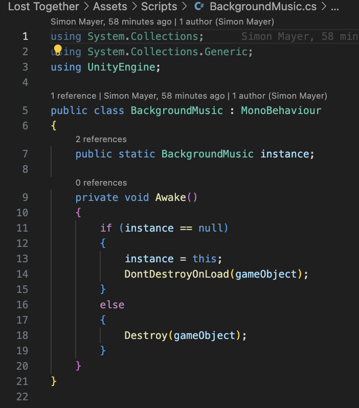 

### Dust Effect
For the dust effect we created a custom dust material which we then used with a particle system to screate a dusto effect for running and landing a jump, so basically whenever a character moves and is on the ground we play the movement particles and same with landing a jump, we play the jump particles, both the particle systems are then children of each character.

.gif)

### Game Loop
The next feature that was added to the project was a game loop. It consists of HoleFinish game object, Game Over Menu, and Player Help UI. So, now if only one of the players enters the Hole at the end of the level then the Help UI will be shown to that player and vice versa. If both players enter the hole, then the Game Over UI is shown to users, when the level is finished. Game Over UI consists of three options which are: Menu, Next, and Restart. In the picture below can be seen Player Help UI, Game Over Menu and Hole finish game object.

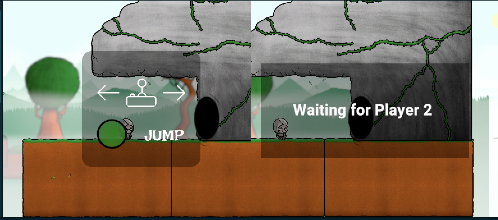 
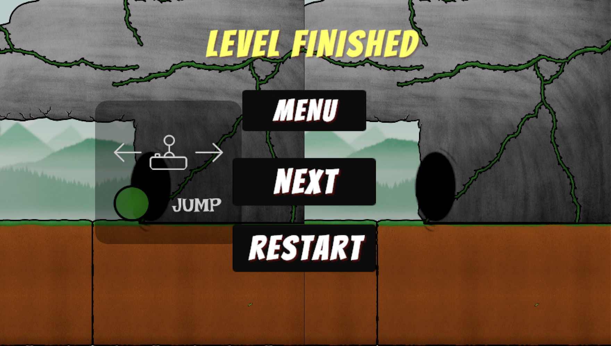 

### Mapping controlls with VIA Arcade Machine
This was a bit more tricky one. We had some troubles with setting the controlls up because we had a very specific scenario, 2 players already in the scene and each of them should be controlled via a controller when connected on button press. We also had to map the menu navigation to the controllers so that it can be seamlessly navigated on the VIA Arcade Machine.

This is the how we handle the controller to player mapping in our script using the PlayerInputManager:

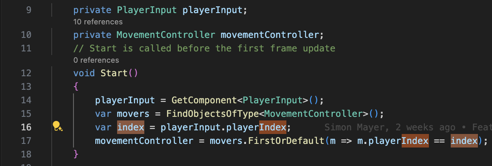 
 
And this is one part of the controller to menu mapping (opening and closing menu on pressing start button on a controller):

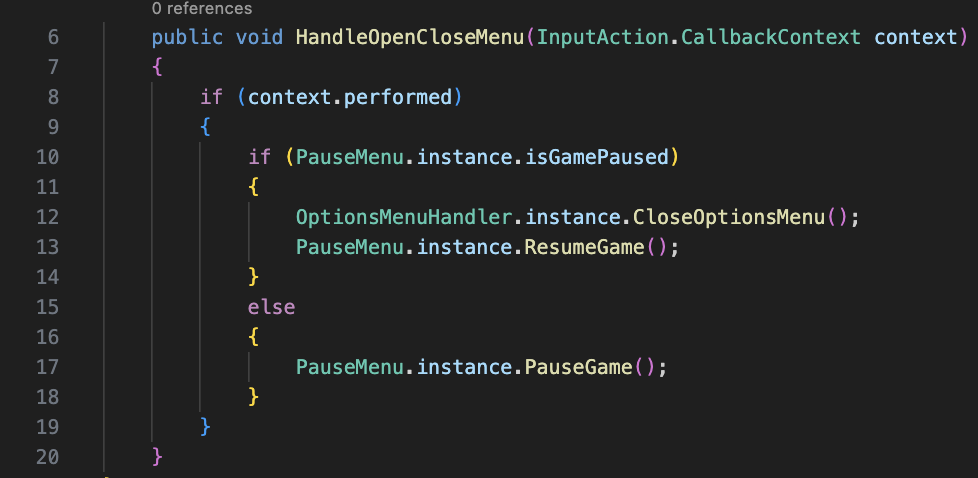 
 

In the function LoadPauseMenu below you can see how we manually assign a first button to be selected when pause menu is loaded, this helps us to navigate through the menu with a controller.

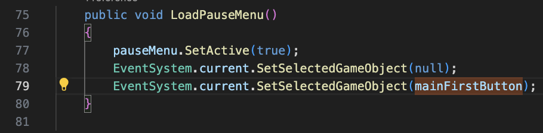 
 

For a better usability we linked the buttons in a menu in a way that if you are on the OPTIONS menu as you can see on the screenshot below, you will then loop all the way back to the top and vice versa.

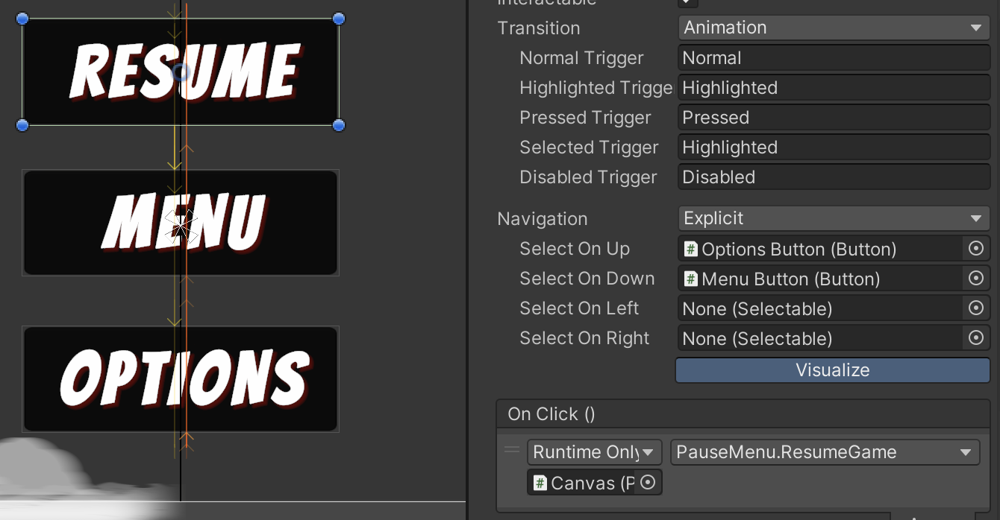 
 

### Enemies
We did not have enough time to complete this feature, so we moved it to the next milestone.
