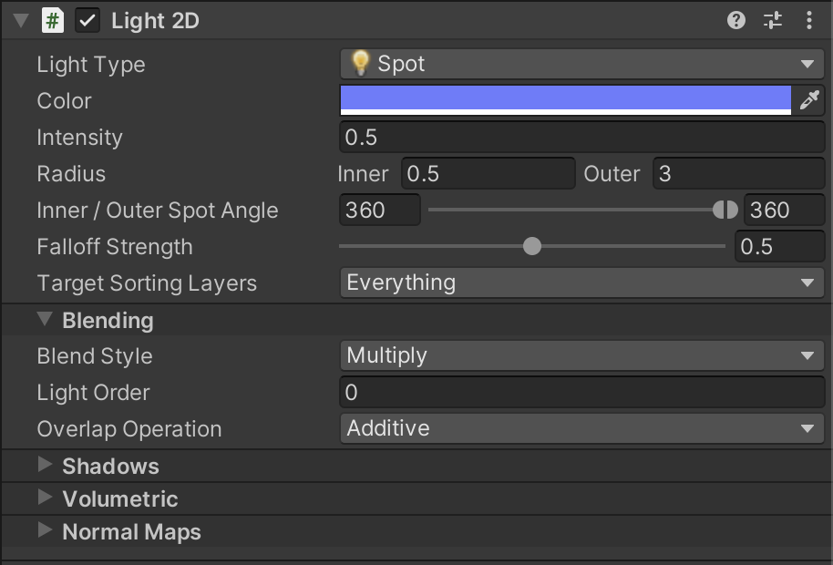
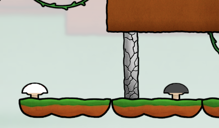

# Lost Together
A cooperative 2D local multiplayer platformer game for 2 players, meant to be played on the VIA Arcade Machine.

## The game
The project itself has 4 scenes - Main menu and 3 levels

<i>Figure 0.1 - Scenes</i>
 

### Menu
The game has the following menus: Main menu, Options menu, Level menu, Pause menu, Level finished menu. All of those use similar practices to either navigate through the game or manage certain settings such as audio volume. 

In the figures below, you can see some of those as an example:

<i>Figure 1 - Main menu</i>
 

<i>Figure 2 - Options menu</i>
 

<i>Figure 3 - Level menu</i>
 

<i>Figure 4 - Level finished menu</i>
 

Most elements within a menu are usually interactable buttons or sliders. For all of those we have implemented custom logic (mostly within a special script for one menu) and assigned specific sound effects for selecting and clicking the elements.

### Level example
There are 3 levels in total. The first level is the shortest and most basic one, it should serve as a demo level, where players understand how the game works (how to move, jump, what objects will kill a character, what kind of game mechanics are there to collaborate on).

The second level is more broad. It introduces new concepts such as splitted path. In theory it should be harder (or at least take longer) to complete this level.

The third and final level is the most extreme one. Not only it is the longest one but it is also in complete dark. The only source of light is a spot light around the characters so that they can watch their step, few platforms, and SOME enemies. It is the most advanced level but on the other hadn it provides the most challenging experience out of all the levels.

<i>Figure 5 - Level 3 - In the dark</i>
 

This is how the light was set up: 

<i>Figure 6 - Light component</i>
 

#### Spikes and Enemies
There are 2 objects that are extremely dangerous for the character - spikes and enemies. If the character comes into a contact with them he will die and respawn at either beginning or the latest achieved checkpoint.

<i>Figure 8 - Spikes</i>
 

<i>Figure 7 - Enemy</i>
 

As shown in the figure 7 above, the enemies have so called <b>patrolling points</b>. The enemy wonders in between those and when a characters steps within the field of those 2 points, the enemy will follow him so watch out!

#### Checkpoints
The checkpoints in the game are used as a respawner. Once a player reaches them, him respawn position is updated to the place of the checkpoint. There are multiple checkpoints in the game as the players progresses throughout the level. The players are always respawned at the position of the latest checkpoint.

<i>Figure 9 - Checkpoint</i>
 

#### Movable elements
Movable elements are the main element of the game that makes two players collaborate with each other. Thanks to those, the game is logical, collaborative, and challenging. There is a fair amount of movable objects in each level. Each of them can be moved by a trigger button that can be pressed by one of the players (depending on the color of the trigger). There are multiple types of movable objects such as movable spike paths, elevators, movable platforms, etc. All of them can either move horizontally or vertically. Some exaples of the movable objects, together with the trigger buttons, can be seen in the figures below.

<i>Figure 10 - Movable Vertical Door</i>
 

<i>Figure 12 - Movable Platform</i>
 

### Character controllers
The game uses the unity's new input system with a few custom modifications as players are already spawned in the scene before button is pressed. There are 2 control schemes that can be used to move the characters: Gamepad and Keybord, where on the keyboard it can either be WAD or Up, Left, Right Arrows. Since the input system only sees a keyboard as one input device, we used the [Keyboard splitter](https://forum.unity.com/threads/keyboard-splitter-local-multiplayer-keyboard.874135/) package from Fenrisul, to make unity think there are multiple and therefore be able to play the game and move 2 separate characters on only one keyboard.

## Conclusion
Overall, Lost Together is a game that combines a 2D multi-layer parallax environment, player collaboration, extensive game levels, enemies, and movable objects controlled by the trigger buttons. The game contains three levels, and each level gives players a completely different sensation and gaming experience. Moreover, the game can be played by 2 players by using either a VIA Arcade Machine or [online](https://davidek776.github.io/GMD-Project/) using gamepads or keyboard. 
